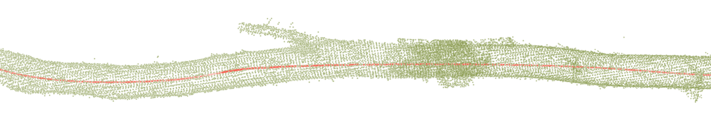

# CENTERLINE CODE

  

Code for generating the central axis of a tree trunk from a 3D scan. This central axis helps capture the tree's curvature more accurately in preprocessing or defect detection algorithms. It is computed by accumulating in the direction of the normals, which are estimated using the PCL library. This accumulation method allows the overall shape of the trunk to be tracked without being disturbed by branches that might interfere with the process. A smoothing step is applied before the central axis is output as xyz coordinates.

## dependencies
## compilation instructions
## example of use